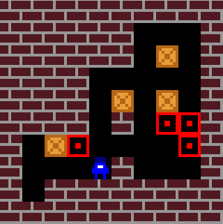

# DeepMind Lab2D

*A learning environment written in C++ and Lua for the creation of grid worlds.*

<div align="center">

</div>

## About

*DeepMind Lab2D* is a system for the creation of 2D environments for machine
learning. The main goals of the system are ease of use and performance: The
environments are "grid worlds", which are defined with a combination of simple
text-based maps for the layout of the world, and Lua code for its behaviour.
Machine learning agents interact with these environments through one of two
APIs, the Python [`dm_env`](https://github.com/deepmind/dm_env) API or a custom
C API (which is also used by [DeepMind Lab](https://github.com/deepmind/lab)).
Multiple agents are supported.

If you use *DeepMind Lab2D* in your research and would like to cite it, we
suggest you cite the
[accompanying whitepaper](https://arxiv.org/abs/2011.07027).

## Installation

[](https://pypi.python.org/pypi/dmlab2d)

[*DeepMind Lab2d* is available on PyPI](https://pypi.python.org/pypi/dmlab2d)
and can be installed using:

```shell
pip install dmlab2d
```

`dmlab2d` is distributed as pre-built wheels for Linux and macOS. If there is no
appropriate wheel for your platform, you will need to build it from source. See
[`install.sh`](install.sh) for an example installation script that can be
adapted to your setup.

## Getting started

We provide an example "random" agent in `python/random_agent`, which performs
random actions. This can be used as a base for creating your own agents, and as
a simple tool to preview an environment.

```sh
bazel run -c opt dmlab2d/random_agent -- --level_name=clean_up
```

## External dependencies, prerequisites and porting notes

*DeepMind Lab2D* depends on a few external software libraries, which we ship in
several different ways:

 * The `dm_env`, `eigen`, `luajit`, `lua5.1`, `lua5.2`, `luajit`, `png`
   and `zlib` libraries are referenced as external Bazel sources, and Bazel
   BUILD files are provided. The dependent code itself should be fairly
   portable, and the BUILD rules we ship are specific to Linux x86 and
   MacOS (x86 and arm64). To build on a different platform you will most likely
   have to edit those BUILD files.

 * A "generic reinforcement learning API" is included in
   [`//third_party/rl_api`](third_party/rl_api).

 * Several additional libraries are required but are not shipped in any form;
   they must be present on your system:

   * `Python 3.8` or above with `NumPy`, `PyGame`, and `packaging`.

The build rules are using a few compiler settings that are specific to
GCC/Clang. If some flags are not recognized by your compiler (typically those
would be specific warning suppressions), you may have to edit those flags.

## Disclaimer

This is not an official Google product.
